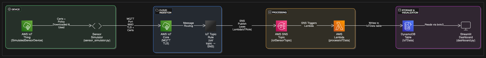

# 📡 Cloud based Serverless IOT data processing with Real-Time Visualization



This project builds a **fully serverless, event-driven IoT data pipeline** using AWS services. It simulates IoT sensor data, processes it using AWS Lambda and SNS, stores it in DynamoDB, and visualizes it via a live Streamlit dashboard hosted on an EC2 instance.

---

## 📌 Project Highlights

- Simulated sensor device publishes MQTT data to AWS IoT Core
- Messages routed to SNS and processed by AWS Lambda
- Processed data stored in DynamoDB
- Real-time dashboard built with Streamlit displays the data
- Fully automated provisioning script included

---

## 🧭 Manual Setup

### 🔧 AWS Console

#### 1. Launch EC2 Instance
- Ubuntu recommended
- Open ports **22** and **8501**

#### 2. Create IAM User: `mqtt-sns-user`
- Enable **programmatic access**

#### 3. Register AWS IoT Thing
- Generate and download:
  - `AmazonRootCA1.pem`
  - `device-certificate.pem.crt`
  - `private.pem.key`
- Place them in: `certs/` inside the repo

#### 4. IAM Policies for `mqtt-sns-user`
Attach these policies or equivalents:
- `lambda:*`, `sns:*`, `iot:*`, `dynamodb:*`
- `iam:PassRole` for `LambdaIoTRole`
- Optional diagnostic access:
  - `iam:Get*`, `iam:List*`, `iam:SimulatePrincipalPolicy`

Sample inline policy for PassRole:
```json
{
  "Effect": "Allow",
  "Action": "iam:PassRole",
  "Resource": "arn:aws:iam::886436951574:role/LambdaIoTRole"
}
```

---

### 🧰 EC2 Instance Preparation

#### Connect and Set Up

```bash
ssh -i <your-key.pem> ubuntu@<ec2-ip>
sudo apt update
sudo apt install awscli python3-pip -y
aws configure  # Use mqtt-sns-user credentials
```

#### Install Python Dependencies

```bash
pip3 install boto3 streamlit pandas paho-mqtt streamlit-autorefresh
```

#### Clone Project Repository

```bash
git clone https://github.com/ganapathysankar-s/iot-sensor-dashboard.git
cd iot-sensor-dashboard
```

---

## ⚙️ Automated Provisioning

Run the provided script:

```bash
bash setup.sh
```

The script automates the provisioning of AWS resources needed for a serverless IoT pipeline. Here's what it does:

### 1. SNS Topic Setup
- Creates a new SNS topic `iotSensorTopic` for message routing

### 2. Lambda IAM Role Setup: 
- Creates the role `LambdaIoTRole`
- Adds trust policy for Lambda and IoT Core
- Grants permissions to:
  - Write to DynamoDB
  - Publish to SNS

### 3. Lambda Function Setup
- Creates a new lambda `processIoTData` and attaches `LambdaIoTRole` to it
- Zips and deploys `lambda_function.py`

### 4. Lambda Trigger Permission
- Adds `sns.amazonaws.com` as allowed principal to invoke the Lambda

### 5. IoT Topic Rule Setup
- Creates IoT Rule `IoTToSNSRule`
- Forwards messages from topic `iot/topic` to SNS using `LambdaIoTRole`

### 6. DynamoDB Setup
- Creates the table  `IoTData` with timestamp as partition key
- Billing mode: `PAY_PER_REQUEST`


---

## 🚀 Run the System

### Start the Sensor Simulator

```bash
python3 sensor_simulator.py > sensor.log 2>&1 &
```

This sends data every 5 seconds over MQTT to AWS IoT Core.

---

### Launch the Dashboard

```bash
streamlit run dashboard.py --server.port 8501 --server.address 0.0.0.0
```

Then open your browser at:
```
http://<ec2-public-ip>:8501
```

---

## Expected Output

- IoT Data routed securely through MQTT to DynamoDB
- Sensor logs stored in `sensor.log`
- CloudWatch logs from Lambda invocations
- Live charts for temperature & humidity in dashboard

---

## 📂 Project Structure

```
iot-sensor-dashboard/
├── certs/ # TLS certs for IoT Core
├── sensor_simulator.py # MQTT simulator
├── dashboard.py # Streamlit dashboard
├── aws_iot_lambda_dynamodb_setup.sh # Full provisioning script
└── README.md # This file
```

---

## 🧠 Author

**Ganapathy Sankar S**  
GitHub: [@ganapathysankar-s](https://github.com/ganapathysankar-s)
